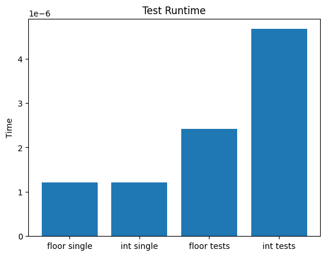

---
jupyter:
  kernelspec:
    display_name: Python 3 (ipykernel)
    language: python
    name: python3
  language_info:
    codemirror_mode:
      name: ipython
      version: 3
    file_extension: .py
    mimetype: text/x-python
    name: python
    nbconvert_exporter: python
    pygments_lexer: ipython3
    version: 3.11.5
  nbformat: 4
  nbformat_minor: 5

title: Ceil and Floor
seo_title: Ceil and Floor
summary: An experiment in reproducing the ceil and floor functions from Python
description: 
slug: ceil-and-floor
author: Kevin Ulrich

draft: false
# date: 2020-11-17T21:21:46-05:00
# lastmod: 2020-11-18T21:21:46-05:00
expiryDate: 
publishDate: 

categories:
  - coding
  - experiment
tags:
  - Experiments

toc: true
related: true
social_share: true
newsletter: false
disable_comments: false
---

# Ceil and Floor

## Backstory

Some time ago, I was thinking about coding experiments that would be easy to do, expand on, and also interesting. One popped into my head then, and so now I'm doing it. Basically, not knowing exactly what magic built-ins do in various languages to be fast and accurate has always interested me, and since I've been doing some coding prep I've been using Python a lot, ans specifically I find myself using `ceil` and `floor` a lot.

So I thought to myself, why not try to reproduce whatever is happening behind the scenes? I'll be doing so without any research or looking at the source code, of course. I'm just going to try and figure it out by intuition and past experience.

## Intro/setup code

``` python
# base imports
from timeit import default_timer as timer
import math
from matplotlib import pyplot as plt
import numpy as np
```


``` python
# define some test cases
test_cases = [2, 2.0, 2.1, 2.4, 2.5, 2.55, 2.7, 3, 3.0]
test_case_ceil_answers = [2, 2, 3, 3, 3, 3, 3, 3, 3]
test_case_floor_answers = [2, 2, 2, 2, 2, 2, 2, 3, 3]

# test just to test the expediency of running a function once
def run_single_test(test_func):
    start = timer()
    test_func(test_cases[0])
    end = timer()
    return end - start

# test runner function
def run_tests_cases(test_func, answers):
    start = timer()
    for i, t in enumerate(test_cases):
        ans = test_func(test_cases[i])
        if ans != answers[i]:
            raise Exception(f"Incorrect answer. Test case {i + 1}: (ans: {ans}, actual: {answers[i]})")
    end = timer()
    return end - start
```

## Baseline

Let\'s first compare the time it takes to run the native `ceil` and
`floor` functions. These will be our baseline.


``` python
# baseline tests
ceil_base_time = run_single_test(ceil)
floor_base_time = run_single_test(floor)
ceil_tests_time = run_tests_cases(ceil, test_case_ceil_answers)
floor_tests_time = run_tests_cases(floor, test_case_floor_answers)

ceil_base_time, floor_base_time, ceil_tests_time, floor_tests_time
```


    (2.916996891144663e-06,
     1.2089949450455606e-06,
     6.707996362820268e-06,
     2.4170003598555923e-06)


## First experiment: `int`

My first thought for `floor` is just to run `int()`. Let\'s see how that
compares.


``` python
int_func = lambda x: int(x)
int_time = run_single_test(int_func)
int_tests_time = run_tests_cases(int_func, test_case_floor_answers)

int_time, int_tests_time
```


    (1.2079981388524175e-06, 4.6670029405504465e-06)


``` python
%matplotlib inline
x=np.array(["floor single", "int single", "floor tests", "int tests"])
y=np.array([floor_base_time, int_time, floor_tests_time, int_tests_time])
fig=plt.bar(x,y)
plt.title("Test Runtime")
plt.ylabel("Time")
```





On a single run\'s basis, `int` can be as fast or even a bit faster than
`floor`, but if used many times in a row it appears it doesn\'t hold up
to `floor` at all, and can be at least twice as slow in this small test
case.

**More coming soon...**

